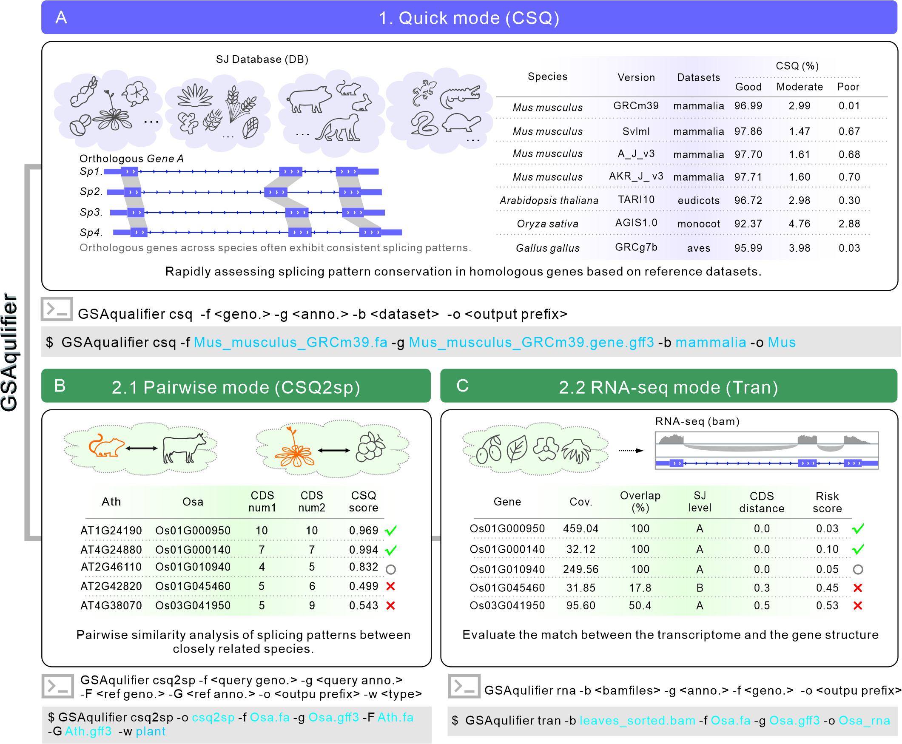

## <font style="color:rgb(0, 0, 0);"> Instructions </font>
**<font style="color:rgb(0, 0, 0);">GSAqualifier comprises three core analysis modes:</font>**

<font style="color:rgb(0, 0, 0);">1) CSQ Quick Detection Mode; </font>

<font style="color:rgb(0, 0, 0);">2) CSQ2sp Inter-Species Gene Comparison Mode; </font>

<font style="color:rgb(0, 0, 0);">3) Tran Transcript-Level Evaluation Mode. </font>

<font style="color:rgb(0, 0, 0);">The CSQ mode is designed for quick screening of annotation quality, while the CSQ2sp and Tran modes focus on comprehensive assessments at the gene level.</font>

<font style="color:rgb(0, 0, 0);"></font>
**** 

<a href="images/Figure1v8.jpg">
  
</a>


## <font style="color:rgb(0, 0, 0);"> Installation </font>
### conda
```shell
mamba create -n test_gsaqualifier -c bioconda  mavismai::gsaqualifier
```

### github
```shell
#Install Dependencies
mamba  create -n GSAqualifier -c conda-forge  python=3.10.5 
conda activate GSAqualifier

mamba  install  -c bioconda  stringtie  mash  regtools gffread
pip install -r requirements.txt
```

```shell
#Download scripts
git clone  https://github.com/Mavis-Mai/GSAqualifier.git

#Download Database
wget https://github.com/Mavis-Mai/GSAqualifier/releases/download/v1.0.0/GSAqualifier_Dataset_v1.0.tar.gz
tar -xzf GSAqualifier_Dataset_v1.0.tar.gz
```


## <font style="color:rgb(0, 0, 0);"> 01. CSQ mode </font>
This mode is specifically designed for the rapid evaluation of splice site accuracy in gene annotations. Users are required to select a suitable reference splice site database based on the species category. By comparing the splicing characteristics of target species genes with homologous genes in the reference database, the system generates a composite evaluation metric called CSQ (Conservative Splice Quality) score. Based on the CSQ score distribution, the system accurately classifies annotated genes into three confidence levels: Good, Moderate, and Poor. Notably, the proportion of genes classified as "Good" can directly reflect the overall accuracy of splice site identification in the genome annotation of a given species, providing researchers with an intuitive quality assessment reference.
**** 

## Database：
| Database name | Type | Gene number |
| :---: | :---: | :---: |
| eudicots | plant | 1,699 |
| monocot | plant | 1,753 |
| embryophyta | plant | 1,205 |
| sauropsida | animal | 3,920 |
| mammalia | animal | 8,086 |
| aves | animal | 3,649 |
| vertebrata | animal | 2,443 |

### Quick Start Guide</font>
```bash
GSAqualifier csq -f  Arabidopsis_thaliana.genome.fna -g Arabidopsis_thaliana.genome.gff3 -l full_table.tsv  -b eudicots
```

### Parameter Description
| Parameter | Description |
| :---: | :---: |
| -f/--fasta | Input the genome file of the target species[fasta]**<****<font style="color:rgb(0, 0, 0);">Required</font>****>** |
| -g/--gtf | Input the genome annotation file of the target species[gff/gtf]**<****<font style="color:rgb(0, 0, 0);">Required</font>****>** |
| -b/--library | Input the name of the corresponding reference database **<****<font style="color:rgb(0, 0, 0);">Required</font>****>** |
| --showdb | Display the information of the built-in optional reference libraries. |
| -o/-output | Output prefix, default: output. <optional> |
| -l/--busco-table | <font style="color:rgb(0, 0, 0);">Input homologous gene mapping table for the detected species in BUSCO </font>[full_table.tsv]<optional> |
| --max-target-seqs | <font style="color:rgb(0, 0, 0);">When a predefined gene family mapping table is not provided, the system will automatically invoke the DIAMOND alignment program to perform homologous gene sequence alignment. This parameter sets the number of optimal match relationships, default: 2 </font><optional> |
| -d/--type | The features for CSQ analysis are calculated using CDS or exon, default: CDS <optional> |

### Results Description
| Result files | Description |
| :---: | :---: |
| output_busco.csq.tsv | Data statistics of splicing information for homologous gene mapping relationships. |
| output_busco_max_CSQ.txt | Select the homologous gene with the highest CSQ score in the mapping relationship. |
| output_busco_label_CSQ.txt | Classify target species genes based on CSQ annotations of homologous genes. |
| output_busco_pie.png/output_busco_pie.svg | Pie chart of target species gene classification. |
| output_busco_pie.stat | Statistical information on target species gene classification. |
| Missing_busco.id | Gene ID information from the database is missing in the annotation of the target genome. |


## <font style="color:rgb(0, 0, 0);"> 02. CSQ2sp mode </font>
This model conducts a detailed and comprehensive analysis of the similarity of each homologous gene by evaluating the CSQ score distribution of homologous genes between two species.
**** 

### Quick Start Guide：
```bash
GSAqualifier csq2sp -f Oryza_sativa_NIP.genomic.fa -g Oryza_sativa_NIP.genomic.gff -F Arabidopsis_thaliana.genome.fna -G Arabidopsis_thaliana.genome.gff3 
-w plant 
```


### Parameter Description：
| Parameter  | Description |
| --- | --- |
| -f/--query_fasta | <font style="color:rgb(0, 0, 0);">Input the genome file of the detected species [FASTA] </font>**<font style="color:rgb(0, 0, 0);"><Required ></font>** |
| -g/--query_gtf | Input the genome annotation file of the detected species [gff/gtf]**<****<font style="color:rgb(0, 0, 0);">Required</font>****>** |
| -F/--ref_fasta | <font style="color:rgb(0, 0, 0);">Input the genome file of the reference species </font>[fasta]**<****<font style="color:rgb(0, 0, 0);">Required</font>****>** |
| -G/--ref_gtf | Input the genome annotation file of the reference species [gff/gtf]**<****<font style="color:rgb(0, 0, 0);">Required</font>****>** |
| -w/--weight_type | Select the weight for CSQ calculation as either "plant" or "animal" based on the input species type **<****<font style="color:rgb(0, 0, 0);">Required</font>****>** |
| -o/-output | <font style="color:rgb(0, 0, 0);">Output prefix (default: output) <Optional ></font> |
| -l/--genepairs | Input the homologous gene mapping table for two species <Optional><br/>If this parameter is missing, the system will default to using Diamond to perform reciprocal matching of the genes from the two species to generate the gene mapping table. |
| -k/--max-target-seqs | <font style="color:rgb(0, 0, 0);">This parameter sets the number of optimal matching relationships (default: 2) <Optional>.</font> |
| -d/--type | The feature used for CSQ analysis is calculated based on CDS or exon (default: CDS) <Optional>. |
| -t/--threads | The number of threads used for alignment (default: 8) <Optional>. |
| --fig_format | Output image format, such as svg, png, or pdf. Default: svg <Optional>. |

### Results Description：
| Result files | Description |
| :---: | :---: |
| output.csq.tsv | Splicing information statistics of homologous gene mapping relationships |
| reciprocal_pairs.tsv | Reciprocal gene pairs of homologous genes|
| CSQ-density.png/CSQ-density.svg | Distribution of CSQ in homologous genes.|


## <font style="color:rgb(0, 0, 0);"> 03. Tran mode </font>
This model comprehensively evaluates and analyzes the splicing status of each expressed gene by incorporating user-supplied transcriptome data into the annotation of the target genome.
**** 

### Quick Start Guide
```bash
GSAqualifier tran -f  Arabidopsis_thaliana.genome.fna -g Arabidopsis_thaliana.genome.gff3 -b bamfile/ -t 10
```
### Parameter Description：
| Parameter | Description |
| :---: | :---: |
| -g/--gtf | Input the genome annotation file of the detected species [gff/gtf] **<Required>** |
| -b/--bam_floder_file | Input the directory containing transcriptome files or the transcriptome files themselves **<Required>** |
| -f/--fasta | <font style="color:rgb(0, 0, 0);">Input the genome file of the detected species [</font>fasta]<Optional> |
| -o/-output | <font style="color:rgb(0, 0, 0);">Output prefix (default: output)</font> <Optional> |
| --force | Force regenerate all results. |
| -m/--min_overlap | Minimum overlap ratio between transcriptome-predicted loci and detected species loci (Default 0.5) |
| -c/--min_support | Minimum threshold for the number of reads supported by the transcriptome (Default 5) |
| -t/--threads | Number of running threads (Default 8) |
| -r/--recordTyep | Extraction of splice sites based on exon/CDS features (Default: exon) |
| --item | Extract exon information items. |
| --idItem | Extract transcript gene items. |

### Results description：
| result files | description |
| :---: | :---: |
| Quality_info | Store files and result images generated during the execution process. |
| Gene_Region | Store files and result images related to gene locus overlaps. |
| Splice_junctions | Store files and result images related to splice site matching. |
| **Total_gene_quality.tsv** | **Detailed table for overall gene quality assessment.** |


